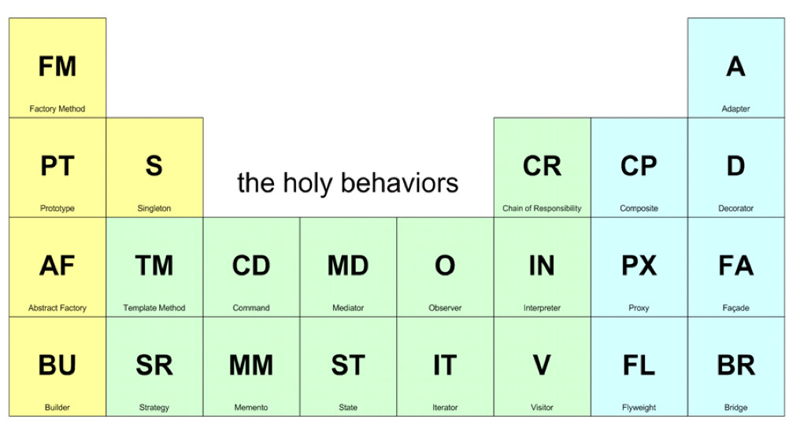

# Introduction

_Slides: [02 Presentation of the course](slides/02-Presentation-of-the-course.pdf)_

## Key concepts
We are moving from Object Oriented Model to Component Oriented Model. That allows the reuse of code and to structure a complex application into pieces.

### Frameworks
With frameworks we have the Inversion of control: the program flow of control is dictated by the framework instead of by the caller. The framework provide a default behaviour, the programmer just have to override functions and handle events.

- Software framework: collection of common code providing generic functionality that can be overridden or specialized.
- Application framework: software framework used to implement the standard application structure for a specific environment.

Examples of frameworks:

- .NET
- Android SDK
- Spring (Java)
- Cocoa (Apple’s native OO API for MacOS that includes the Objective-C runtime. 
- IDEs
- MFC: Microsoft Foundation Class Library (C++ GUI)
- Gnome (Linux GUI library in C)

### Design Patterns

## Course objectives
- Programming language technology
  - Executions models
  - Runtime
- Virtual Execution Environment
  - Memory Management
  - Thread Management
  - Exception Handling
  - Security
  - Debugging Support
  - AOT and JIT Compilation
  - Dynamic Link/Load
  - Reflection
  - Verification
- Programming metaphors
  - Objects
  - Components
  - Patterns

- Advanced Programming Techniques
  - Generic Programming: Java Generics, C++ templates, C# Generics, Scala generics
  - Lambda Calculus and Functional Programming: Haskell, Type classes and Monads, Metaprogramming
  - Functional Programming: Lambdas and Stream API in Java 8
  - Scripting languages: Python
