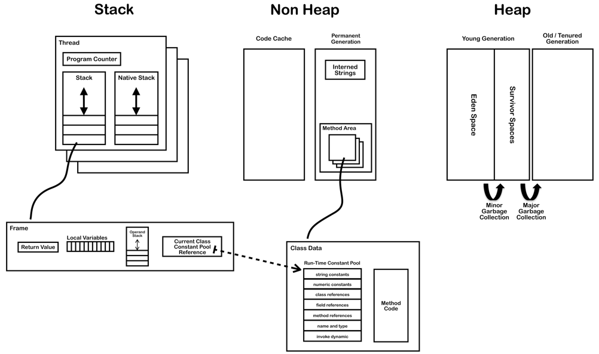
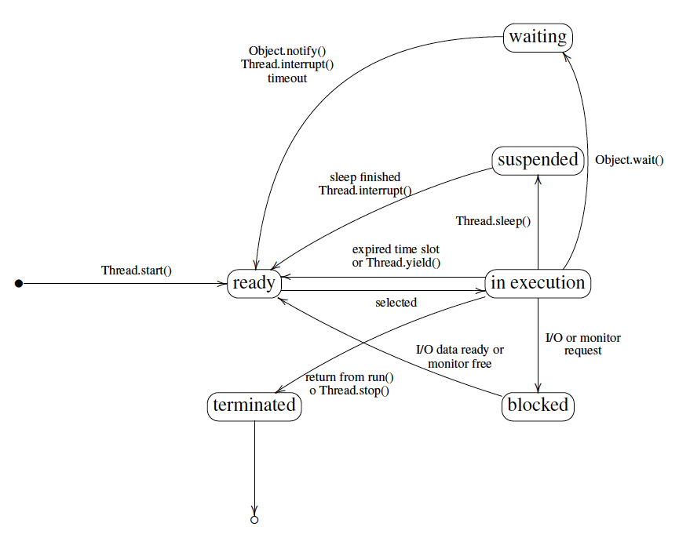

# Runtime systems

_Slides:_

- _[04 Runtime systems](04-Runtime-systems.pdf)_
- _[05 JVM internals](05-JVM-internals.pdf)_
- _[06 JVM instruction set](06-JVM-instruction-set.pdf)_

A runtime system implements the execution model of a programming language and provides a runtime support.

**The runtime system can be made of:**

- code in the executing program generated by the compiler
- code running in other threads or processes during the program execution
- language libraries
- OS functionalities
- the interpreter/VM itself

**The runtime support is needed for:**

- memory menagement: push/pop activation records on stack, allocation and garbage collection on heap
- I/O management
- runtime environment interaction
- parallel execution threads/tasks/processes
- dynamic type checking and bounding
- dynamic linking
- debugging, JIT compilation, etc.

## Java Runtime Environment (JRE)
Includes all what is needed to run compiled Java programs (bytecode).  
It is made by the JVM and the JCL (Java Class Library, aka Java API).

# Java Virtual Machine (JVM)
It is an abstract machine for the bytecode.  
Oracle doesn't provide details about the implementation of the JVS, but there are **specifications for a machine indipendent class file format**. Every language that can be compiled in a .class file can be executed by the JVM.

Each JVM has an internal representation (implementation dependent) of classes, objects and primitive types.

The JVM is a multithreaded stack-based machine.  
Each instruction implicity take the arguments from and put the operands to the top of the operand stack of the current frame.  
The operand stack stores also local variables and intermediate results.

### Stack frames
Are often allocated on the heap and contains:

- Local variable array: contains all the variables used during a method execution
- Operand stack: general-purpose registers
- Reference to constant pool of current class
- Return address

## JVM Data Types
Primitive types:

- boolean
- byte, short, int, long, char
- float, double
- return address (internal, for exception handling)

Reference types:

- array
- class
- interface

### Object representation

Is left to the implementation. Must include the concrete value of `null`, pointers to instance and class data, mutex locks and garbage collection flags.

## JVM runtime data areas
- heap: arrays and objects (they have a non-fixed size)
- Non-Heap: objects considered logically part of the JVM
    - Permanent generation: method area and interned strings
    - Code cache: cache for the code compiled with the JIT compilation

### Threads
Multiple threads are possible starting from a single `main`. Moreover, there are several background threads for garbage collection, signal dispatching, JIT compilation, etc.

Threads have **shared access to heap and persistent memory**. The latter includes the method area, interned strings, and code cache for JIT compilation.

Each thread has its **separate stack area**. That area **includes**:

- PC: **pointer counter** to the next instruction in the method area
- Java **stack**: a stack of frames (activation records), a frame is added every time a method is invoked and destroied every time the methods completes. Them are not allocated continuosly.
- Native stack: used for invocation of native functions.   

#### Thread life-cycle

### Non-Heap: the Method Area
Contains:

- Classloader Reference
- From the class file:
  - Run Time Constant Pool
     - constants and symbolic references for dynamic binding (numeric and strings literals, class, methods and fields references, signatures)
     - operands in bytecodes
  - Field data
     - Name
     - Type
     - Modifiers
     - Attributes
  - Method data
     - Name
     - Return Type
     - Parameter Types (in order)
     - Modifiers
     - Attributes
  - Method code (per method)
     - Bytecodes
     - Operand stack size
     - Local variable size
     - Local variable table
     - Exception table
     - LineNumberTable (which line of source code corresponds to which byte code instruction, for debugging)
  - Per exception handler (one for each try/catch/finally clause) 
     - Start point
     - End point
     - PC offset for handler code
     - Constant pool index for exception class being caught

## Garbage collector
Is applied on the heap

1. object and arrays are created into the young generation
2. object alive are moved from the eden space to the survivor space
3. survived object are moved into the old generation, the others deallocated
4. every time the old generation is full is garbage collected (the young generation is garbage collected constantly)

### Object finalization
Before deallocating an object, the Garbage Collector calls the `finalize` method. It is possible to override this method, although deprecated.

The finalization is called also on classes, usually when JVM exits. A class can be finalized only if no object of this class exists or the exist one are unricheable.

## JIT compilation
Since interprete bytecode is not as fast as execute native code, the JVM look for bytecode that is executed several time and compile it to native code. This code is stored in the code cache area of the non-heap memory area.

## JVM Internals

### Disassembling Java files
- compile: `javac Class.java`
- run: `java Class.class`
- decompile: `javap -c -v Class.class`

### JVM startup
- bootstrap classloader
- class is linked and initialized
- main is invoked
- loading (finding binaries), linking (preparing executable) and initialization (`clinit` method) of additional classes

The linking consists in:

- verification: correctness, overflow and underflow, variables and types validity, data-flow analysis
- preparation: allocation of storage
- resolution (optional): loading of the referred classes and interfaces (can be posponed to first use)

## JVM Instruction set

### Interpreter loop
1. Calculate PC and fetch opcode
2. if (operand) fetch operand
3. execute op

### Instruction format
- Byte alligned, the number that preceed an instruction indicates its byte position. Each opcode occupies 1 byte.
- JVM supports 3 addressing modes:
    1. Intermediate, with a constant as part of instruction;
    2. Indexed, with the index of the local var array;
    3. Stack, pop from the top of the operand stack.
- JVM instructions are explicity typed (`iload`, `lload`, ..., `istore`, ...):
    - i int
    - l long
    - s short
    - b byte
    - c char
    - f float
    - d double
    - a for reference
- The computational type of the instruction is embedded in the opcode.

### Memory access
Different JVM data areas ⇒ different instruction for memory access:

- local var and arguments: `load` and `store` (operand stack)
- fields in objects: `getfield` and `putfield` (heap)
- static fields: `getstatic` and `putstatic`(method area)

### Instruction examples
- Array instructions: load, store, utilities (such as `newarray`, `arraylength`).
- Operand stack manipulation: `pop`, `dup`, `swap`.
- Control transfer: unconditional (e.g. `goto`) or conditional (`ifeq`, `iflt`, `ifgt`, ...).
- Method invocation: `invokevirtual` on objects, `invokeinterface` for interfaces, `invokespecial` for constructors, private or superclass methods, and `invokestatic` for static methods.
- `return`, `ireturn`, `lreturn`, etc.
- Object allocation: `new`.
- Special instructions: `nop`, `athrow` (throws exception), `instanceof` (verifies instances), `checkcast` (checks a casting operation)
