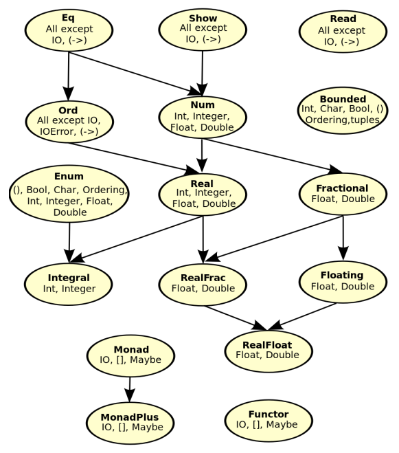
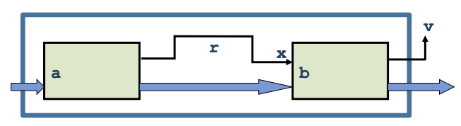

# Haskell

_Slides:_

- _[19 Haskell](19-Haskell.pdf)_
- _[20 Haskell type classes](20-Haskell-Type-classes.pdf)_
- _[21 Haskell Constructor classes and Monads](21-Haskell-Constructor-classes-Monads.pdf)_


## Data types
```
data Color = Red | Yellow | Blue
```

```
data Tree = Leaf Int | Node (Int, Tree, Tree)
```


## Case expressions
```
case t of
  Leaf n -> ...
  Node(n, lt, rt) -> ...
```


## Function types
`f :: A -> B` means for every x ∈ A, if f(x) terminates, then f(x) ∈ B.


## Higer order functions
Any curried function with more than one argument is higher-order: applied to one argument it returns a function.

### From functional to stream-like
```
length(tail(reverse [1,2,3])) => 2
```
becomes
```
[1,2,3] |> reverse |> tail |> length => 2
```

### Map
Applies argument function to each element in a collection.

```
map (+1) [1,2,3] => [2,3,4]
```

### Filter
Takes a collection and a boolean predicate, and returns the collection of the elements satisfying the predicate.
```
filter even [1..10] => [2,4,6,8,10]
```

### Reduce
`foldl`, `foldr`, `foldl'`, `foldl1` etc.
```
sum' xs = foldl (\acc x -> acc + x) 0 xs
```
The difference between `foldl` and `foldr` is that the first start from the top, so is appliable also to infite lists, the second one requires a finite list.

The difference between `foldl` and `foldl'` is that the second one uses tail-recursion (see below) and for that reason is more performant.


## Recursion
Iteration and recursion are equally powerful in theoretical sense. Anyway, in general a procedure call is much more expensive than a conditional branch, thus recursion is in general less efficient.

### Tail recursive functions
#### Non tail-recursive
```
int rfun() {
  ...
  return 1+rfun();
}
```

#### Tail recursive
```
int trfun() {
  ...
  return trfun();
}
```

#### Example
Quadratic, non tail recursive
```
reverse [] = []
reverse (x:xs) = (reverse xs) ++ [x]
```
Can be rewritten with tail-recursion in linear time
```
reverse xs =
  let rev ([], accum) = accum
      rev (y:ys, accum) = rev (ys, y:accum)
  in rev (xs, [])
```


## Type classes
Provide concise types to describe overloaded functions.

Allow users to define functions using overloaded operations and to declare new collections of overloaded functions.

A type class declaration defines a set of operations and gives the set a name.  
Example: `Eq a` type class defines the operations `==`  and `\=` with type `a -> a -> Bool`.  
Usage: `member:: Eq w => w -> [w] -> Bool`.

### Default type classes
- `Eq`: equality
- `Ord`: comparison
- `Num`: numerical operations
- `Show`: convert to string
- `Read`: convert from string
- `Enum`: operations on sequentially ordered types



### Declaration
The class declaration says what the Num operations are.
```
class Num a where
  (+) :: a -> a -> a
  (*) :: a -> a -> a
  negate :: a -> a
  ...
```

### Instance
An instance declaration for a type Int says how the Num operations are implemented on Int’s.
```
instance Num Int where
  a + b = intPlus a b
  a * b = intTimes a b
  negate a = intNeg a
  ...
```

### Default methods
Type classes can define default methods. Instance declaration can still override it by providing a more specific definition. If an instance declaration doesn't provide a method implementation, the default one is applied.
```
class Eq a where
  (==) :: a -> a -> Bool
  x == y = not (x /= y)

  (/=) :: a -> a -> Bool
  x /= y = not (x == y)
```
If is not necessary to override the default definition, deriving can be used.

#### Deriving
For `Read`, `Show`, `Bounded`, `Enum`, `Eq` and `Ord` the compiler can generate instance declaration automatically.
```
data Color = Red | Green | Blue
  deriving (Show, Read, Eq, Ord)
```

### Under the hood
This
```
square :: Num n => n -> n
square x = x * x
```
is compiled into this
```
square :: Num n -> n -> n
square d x = (*) d x x
```
where the extra value argument d of the function is a value of data type Num n and represents a dictionary of the required operations.

Furtermore, the compiler converts each type class declaration into a distionary type declaration and a set of selector functions. In other words, this
```
instance Num Int where
  a + b = intPlus a b
  a * b = intTimes a b
  negate a = intNeg a
  ...
```
is compiled into this
```
dNumInt :: Num Int
dNumInt = MkNum intPlus
                intTimes
                intNeg
                ...
```

#### Compositionally
```
sumSq :: Num n => n -> n -> n
sumSq x y = square x + square y
```
becomes
```
sumSq :: Num n -> n -> n -> n
sumSq d x y = (+) d (square d x) (square d y)
```


## Functor
A type class where the predicate is over a type constructors rather than on a type.

Example:
```
instance Functor Tree where
  fmap f (Leaf x) = Leaf (f x)
  fmap f (Node(t1,t2)) = Node(fmap f t1, fmap f t2)
```

## Monads
Constructor classes (type constructor) introducing operations for "putting a value into a box" (`return`) and compose functions that return "boxed" values (**bind**: `x >>= y`).

`(>>=) :: Maybe a -> (a -> Maybe b) -> Maybe b`

Functors with fmap allow to apply functions inside "boxes".

### Haskell monads
- Maybe
- Error
- State
- IO
- lists (`[]`)
- Reader
- Writer

### Maybe
`data Maybe a = Nothing | Just a`

A value of type `Maybe a` is a possibly undefined value of type `a`.  
A function `f :: a ->  Maybe b` is a partial function from `a` to `b`.

### Main
`main::[Response] -> [Request]`

### IO
IO is a type constructor, instance of Monad. A value of type `IO t` is a computation or "action" that, when performed, may do some input/output before delivering a result of type t.

- `return` returns the value without making I/O
- Then (`>>`) and bind (`>>=`) composes two actions sequentially into a larger action.

`(>>=) :: IO a -> (a -> IO b) -> IO b`



Binds the result of the left-hand action in the action on the right.

Evaluating an action has no effect, performing the action has the effect.  
The only way to perform an actio is to call it at some point, directly or indirectly, from Main.main.
